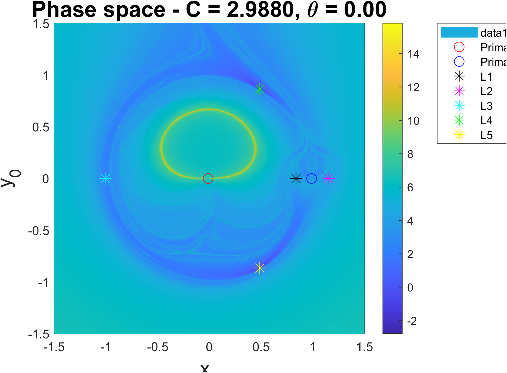

# Visualization of Dynamics in the Circular Restricted Three-Body Problem (CR3BP) using Lagrangian Descriptors

[](https://opensource.org/licenses/MIT) 

A MATLAB implementation to reconstruct the phase space of the Circular Restricted Three Body Problem (CR3BP), focusing on invariant structures via Lagrangian Descriptors. This repository supports an ongoing paper exploring geometric and numerical insights.

## Introduction

The Circular Restricted Three-Body Problem (CR3BP) is a fundamental simplification of the classical three-body problem in celestial mechanics. In this formulation, the mass of the third body is assumed to be negligible compared to the other two, which are referred to as the primary bodies. It is also assumed that the primary orbits describe circular orbits around their centre of mass and are not affected by the third body's mass. As in  the general version, the system does not admit a general closed-form solution. As a consequence, the restricted three-body problem must be studied primarily through numerical methods. Despite being an approximation, this model preserves the essential dynamical features of the full problem, including equilibrium points (Lagrange points) and complex periodic orbits. The main goal is to reconstruct the phase space using Lagrangian Descriptors.

This repository provides the code to compute and visualise these structures, bridging theoretical Hamiltonian mechanics with practical numerical integration.

## Mathematical Background

We work in the $XY$-plane in a rotating frame attached to the primary masses and all quantities are expressed in nondimensional units as done in classical literature. In this system, we choose the sum of the mass of the primaries as the unit of mass, the distance between them as the unit of distance and the orbital period as unit of time. Under these assumptions it is easy to check that the parameters are:

$$
m_1 = 1 - \mu,\quad m_2 = \mu,\quad \omega = 1, \quad G = 1,
$$

where $\mu$ is called the mass parameter. 

This formulation allows us to describe all possible configurations of the CR3BP by varying only the mass parameter $\mu$ and reduces computing complexity.

The CR3BP admits the Hamiltonian formulation

$$
H(x, y, p_x, p_y) = \frac{1}{2} (p_x^2 + p_y^2) + (x p_y - y p_x) - \frac{1 - \mu}{d_1} - \frac{\mu}{d_2},
$$

where $p_x:=\dot{x}-y$, $p_y:=\dot{y}+x$ are the classical momenta and $d_1 = \sqrt{(x+\mu)^2 + y^2}$ and $d_2 = \sqrt{(x−1+\mu)^2 + y^2}$ the distance to the primary masses. The Hamiltonian encodes the equations of motion we obtain in Newtonian Mechanics:

$$
\ddot{x} = -\frac{1-\mu}{d_1^3}(x + \mu) - \frac{\mu}{d_2^3}(x - 1 + \mu) + x + 2\dot{y},\\
$$

$$
\ddot{y} = -\frac{1-\mu}{d_1^3} y - \frac{\mu}{d_2^3} y + y - 2\dot{x},
$$

the equations we integrate numerically in the Lagrangian descriptors method. Introducing the classical effective potential $\Omega(x, y)=\frac{1}{2} (x^2 + y^2) + \frac{1 - \mu}{d_1} + \frac{\mu}{d_2}$, it can be expressed as:


$$
H = \frac{1}{2} (\dot{x}^2 + \dot{y}^2) - \Omega(x, y).
$$

Equivalently:

$$
C := 2\Omega(x, y) - (\dot{x}^2 + \dot{y}^2) = 2\Omega(x, y) - v^2,
$$

where $C$ is the Jacobi constant. This parameter determines the energetically accessible regions of configuration space through the condition $\dot{x}^2 + \dot{y}^2 \geq 0 \Leftrightarrow 2\Omega(x, y) \geq C$ and plays a fundamental role in the qualitative analysis of the dynamics.


### Construction of the Phase Space

This problem is a four-dimensional dynamical system in terms of position and momentum $(x, y, p_x, p_y)$. As the phase space is four dimensional, we must adopt a non-arbitrary and systematic way of choosing these initial conditions to reduce the dimensionality and obtain informative images.


As the Jacobi constant is preserved along the solutions, the dynamics of a particle is constrained in a three-dimensional submanifold of the phase space where $C$ is constant. Hence, we reduce the dimensionality of the problem to the study of submanifolds which have a clear physical interpretation. These manifolds can be drawn and studied directly but for the sake of simplicity we further reduce the dimensionality so we have the $(x, y)$-plane.  This structure naturally facilitates the reconstruction and visualization of the three-dimensional manifold by stacking the $(x, y)$-planes corresponding to different velocity directions. 

To obtain the $(x, y)$-plane, we can consider polar coordinates for the velocity $\dot{x} = v \cos \theta$, $\dot{y} = v \sin \theta$. Having  chosen the value of $C$, we are forced to take $v = \sqrt{2\Omega(x, y) - C}$. In that way the parameter left to fix corresponds to the angle $\theta \in [0, 2\pi)$. This corresponds to selecting a transversal section of the Jacobi energy manifold.

This construction provides a systematic and non-arbitrary way of selecting initial conditions on a constant Jacobi manifold and provides a clear and intuitive geometric interpretation of the dynamics.

### Lagrangian Descriptors Method
The method of Lagrangian descriptors (LD) is based on the intuition that particles with trajectories that evolve following similar behaviours will have traveled similar distances. In case one of these crosses a separating object, their behaviour will be different and the arc-length function will have sharp gradients. Following this intuition LDs consist on computing over a grid of initial conditions the integral of positive functions along trajectories over a finite time interval, both forward and backward in time; taking the integral in the future gives stable manifolds, whereas integrating backward in time gives the unstable manifolds. Unlike other methods, LDs rely on the global properties of trajectories.

The Lagrangian Descriptors' ability to directly visualise invariant structures, combined with their moderate computational cost, flexibility in the choice of phase space slices and the easiness to distinguish stable and unstable manifolds, makes them especially well adapted to the high-dimensional setting of the CR3BP.


## Installation

- MATLAB R2024b or later (tested; earlier versions may work).
- Clone the repo: `https://github.com/CarlosGomezRedondo24/ThreeBodyProblem_PhaseSpace-Matlab` .
- Ensure the Parallel Computing Toolbox is installed in your MATLAB environment. This project is optimized for multi-core CPUs. Using the Parallel Computing Toolbox significantly reduces execution time. 
- To take full advantage of high-performance execution, the project utilizes parfor loops. The parallel pool will automatically start upon running the main script.

## Quick Start
1. Open MATLAB in the repo folder.
2. Run `main.m` using default settings. 
3. What you get:
   - Phase space plots with Lagrangian Descriptors.
   - Selected trajectories overlaid.
   - All saved automatically in `results/Exp_.../Images/`.
**Notes:**
    - Using default configuration, the code runs in 9 minutes in Intel(R) Core(TM) i5-10210U CPU @ 1.60 GHz (4 cores).
    - In folder [results] (CR3BP/results/Exp_xsp3_ysp3_dx400_dy400_mu1.215454e-02/Images) you can find the output for a longer run (Resolution 400x400, `energy_idx=[4,8]`, `thetas=[0,pi/2, pi, 3*\pi/2]`, `N=2` `mu=1.215454e-02` and all saving options 'true' except `plt_trajectories` and `save_trajectory`.)

Here are some example outputs the code can produce (`Resolution 600x600`,`mu=1.215454e-02`):


*Stable/unstable manifolds and chaotic separatrix clearly visible*


## Configuration (edit directly in main.m)

All settings are defined at the top of `main.m`. Change them freely according to your needs.

Main groups of parameters:

- **Grid**  
  - Spatial domain:`x0`, `y0`. Sets the boundaries of the grid. *Recommended*:`[-1.5, 1.5]` to capture the main system dynamics.
  - Resolution : `dx`, `dy`. *Minimum:* `200`. *Recommended:* `400` (provides balance between detail and speed).

- **Jacobi constants / energies**  
  - Vector of energy values: `C_values` (or use levels related to Lagrange points via `energy_idx`).

- **Velocity directions**  
  - Vector of angles: `thetas` (in radians).

- **Integration & output**  
  - Integration Time: It is recommended to integrate for a total time of at least `4π` (approx. 12.57), which corresponds to two full orbits/cycles.
  - `N` → number of integration steps per descriptor. 
    * Recommended Value: `2`, as the ODE solver uses adaptive stepping to choose the best points automatically. 
    * High Resolution (`200` to `1000`): Use these values only when plotting full trajectories (`plt_trajectories = true`).
    * Value of `200` (not recommended): For calculation-only purposes. Values higher than 2 are generally unnecessary unless working with very low energy constants.
- **Visualization Toggles**    
  - `save_data`, `plt_phase_space`, `plt_stb_man`, `plt_unstb_man`, `plt_trajectories` → independent toggles saving/plotting  (For trajectory plotting: `plt_trajectories = true ` and `save_trajectory = true` ).
  - `traj_pos` → grid indices for which to plot full trajectories.

-  **Folder structure** 
   ```   
      results/
      ├── Exp_μ0.01215_C3.0000/           ← each parameter combination
      │   ├── Data/                       ← .csv with LD values & trajectories
      │   └── Images/                     ← .png plots (300 dpi)
      └── ...
   ```
**Notes**
- Higher resolution (`dx`, `dy`) and more angles (`thetas`) → sharper results but much longer runtime.
- The code automatically skips already-computed results (data & plots).

 
**Key functions**:
- `LDs(dx, dy, tspan, ...)`: Core computation of descriptors.
- `Plot_phase_space(...)`: Visualises results.
- `Calculate_Plot_trajectories(...)`: Plots specific trajectories if enabled.

## Limitations
- Focus on 2D slices; full 4D phase space requires stacking multiple runs.
- Higher grid resolutions produce significantly sharper and more detailed phase space images, but execution time increases rapidly. 
- While ode113 is highly efficient for smooth orbital paths, trajectories involving close encounters with primary bodies significantly increase the computational load due to the adaptive step-shrinking mechanism.

## Work in progress
- 3D manifold rendering and plotting trajectories on the real manifold. The code will be refactored and uploaded in the repository. You can see a sample image in [Sample 3D phase space](CR3BP/media/Phase_Space_3D_C_3.0122.png).
- Code that generates video sequences showing the step-by-step numerical integration of a single trajectory, while the background field  is synchronously updated so that each frame exactly matches the 2D transversal section of the constant-Jacobi-constant invariant manifold currently being traversed by the particle. The code will be refactored and uploaded in the repository. You can see a sample video in [Sample trajectory video](CR3BP/media/Video_trajectory.mp4).


## References
- C.N.J (1998). The Lagrange points. WMAP Education and Ou., pages 1-8.
- Quillen, A. (2023). Phy411 lecture notes - Introduction to Hamiltonian and Lagrangian mechanics. University of Rochester. 
- Mathworks (2024). Matlab help. https://es.mathworks.com/help/matlab/math/choose-an-ode-solver-html [Accessed 9th of May 2025].
## License

MIT License. See [LICENSE](LICENSE) for details. Contributions welcome—fork and PR!

